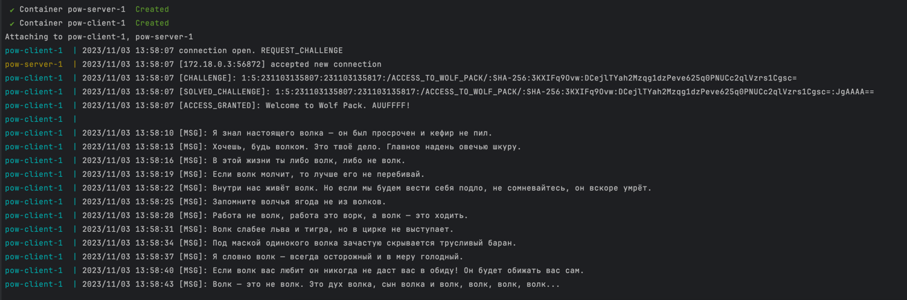
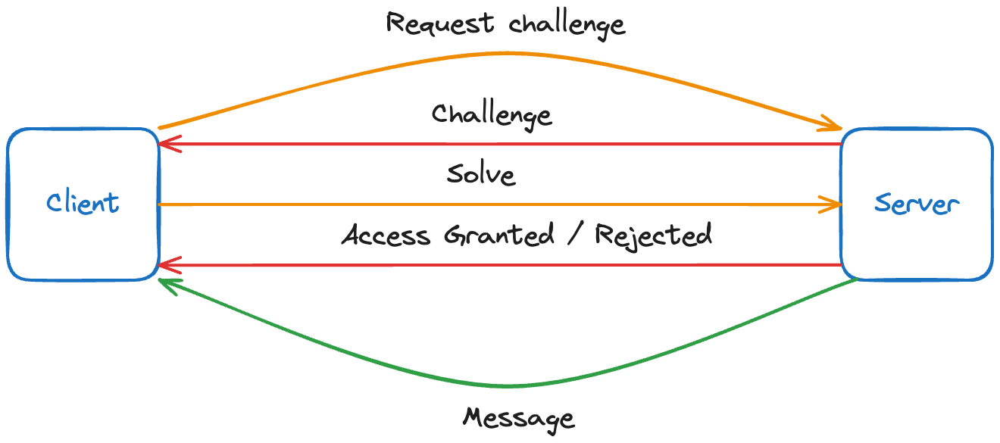

# Proof of work (PoW) implementation




### Quick start

```shell
PRIVATE_KEY=private-key docker-compose up
```

### How was implement Hashcash for TCP wolf pack server

#### Challenge–response protocol


#### Why did I choose hashcash
- it's quite simple and fast than puzzle and many others

#### Hashcash Segments Explained
```shell
1:5:231103135807:231103135817:/ACCESS_TO_WOLF_PACK/:SHA-256:3KXIFq9Ovw:DCejlTYah2Mzqg1dzPeve625q0PNUCc2qlVzrs1Cgsc=
```

| position | name | value |                                                                                                                                    description                                                                                                                                     |
|----------|------|-------|:----------------------------------------------------------------------------------------------------------------------------------------------------------------------------------------------------------------------------------------------------------------------------------:|
| 0        |   version   | 1     |                                                                                                                                      version                                                                                                                                       |
| 1        |   bits   | 10    |                                                                                                                              Number of leading zeros.                                                                                                                              |
| 2        | issued a     |231103135807  |                                                                                                                                   date of issue                                                                                                                                    |
| 3        |  expired at    | 231103135817 |                                                                                                                                   date of expire                                                                                                                                   |
| 4        |   resource   |  ACCESS_TO_WOLF_PACK     |                                                                                                                                   request scope                                                                                                                                    |
| 5        |   algorithm   |   SHA-256    |                                                                                                                     Hashcash algorithm (SHA1, SHA256, SHA512)                                                                                                                      |
| 6        |  nonce    |   3KXIFq9Ovw    |                                                                                        String of random characters from alphabet a-zA-Z0-9+/= to avoid preimage with other sender's stamps                                                                                         |
| 7        | signature     |   DCejlTYah2Mzqg1dzPeve625q0PNUCc2qlVzrs1Cgsc=    |          The signature of our stamp, which guarantees that the stamp has not been tampered with                                                                                                                                                                                                                                                                          |
| 8        |   counter   |   JgAAAA==    | To find a stamp with the desired number of preimage bits need to try lots of different strings this counter is incremented on each try. The Counter is also composed of characters from the alphabet a-zA-Z0-9+/=. (Note an implementation is not required to count sequentially). |

